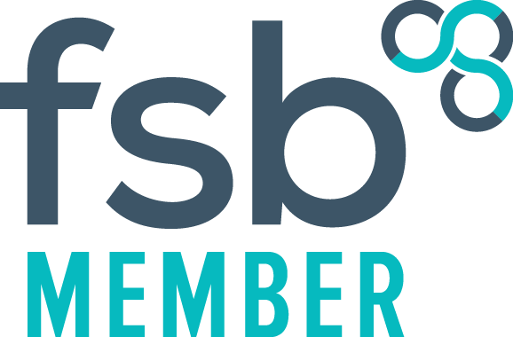

# About us

Icy Waters Consulting Limited was established in 2023 to provide management consulting services to help organisations deliver excellent services to citizens.  
Based in Worcestershire, but working nationally, Icy Waters Consulting supports public and private sector organisations to establish new services or improve existing services in order to support citizens more effectively. 
Our clients will predominantly be those supporting and delivering services to children and adults, including statutory children’s and adults social care services.

# Services we offer

We are committed to working in partnership with our clients to design and improve services that can be delivered effectively and which ultimately benefit individual’s lives.
We will typically combine a range of services and expertise to deliver these objectives, for example:

* Service Design and Implementation
* Operational Transformation
* Change Management
* Project and Programme Management
* Business Analysis
* Business Process Design
* Operating Model Design
* Programme Delivery
* Coaching & Mentoring
* Lean and Six Sigma methods and tools

# Meet the team

 **Ian Waters**

Ian is the managing director and will lead client delivery.
Ian’s background as a Social Worker within a local authority alongside# his experience leading transformation programmes in the public sector gives him a unique perspective enabling him to work effectively at all levels of an organisation, with external policy makers and regulators to design and deliver services to improve outcomes. 
Ian is passionate about improving citizen’s lives and has significant transformation experience in organisations responsible for children’s social care, adult’s social care and Integrated Care Systems (ICSs). A common feature of his work has been translating ‘external’ strategies and policy shifts into workable solutions that benefit the local context and individual staff and citizens. 
Ian brings significant experience of project management and programme leadership and has led large and complex change programmes delivered within challenging stakeholder environments. He has worked extensively for central government departments including the Department for Education (DfE) and Department of Health and Social Care (DHSC), local authorities, ICSs, and private children’s services providers. 
Prior to consulting, Ian held various practice and managerial roles across children’s social care, including in local authority children’s homes, services for children in care, youth offending teams and frontline child protection services. 

# Contact us

If you would like to get in touch to talk about new or existing work, then please email [ian@icywaters.co.uk](mailto:ian@icywaters.co.uk)
If you would like to discuss payments, invoicing or other financial matters please contact [finance@icywaters.co.uk](mailto:finance@icywaters.co.uk)
If you have more general questions, then please email [admin@icywaters.co.uk](mailto:admin@icywaters.co.uk)
If you have a question relating to data and our privacy notice, then please email [data@icyewaters.co.uk](mailto:data@icyewaters.co.uk)

# Data privacy

Please click on the link for a copy of our [privacy notice.](/assets/Privacy policy FINAL 5Dec23.pdf)

# Company details

- Icy Waters Consulting Limited. Registered Office: The Oakley, Kidderminster Road, Droitwich, Worcestershire, WR9 9AY. Company Number 15281378
- Icy Waters Consulting Limited is registered with the Information Commissioner’s Office. Registration reference: ZB636399
- Ian Waters is a social worker, registered with Social Work England. Social worker registration number: SW42532
- Member of the Federation of Small Businesses

